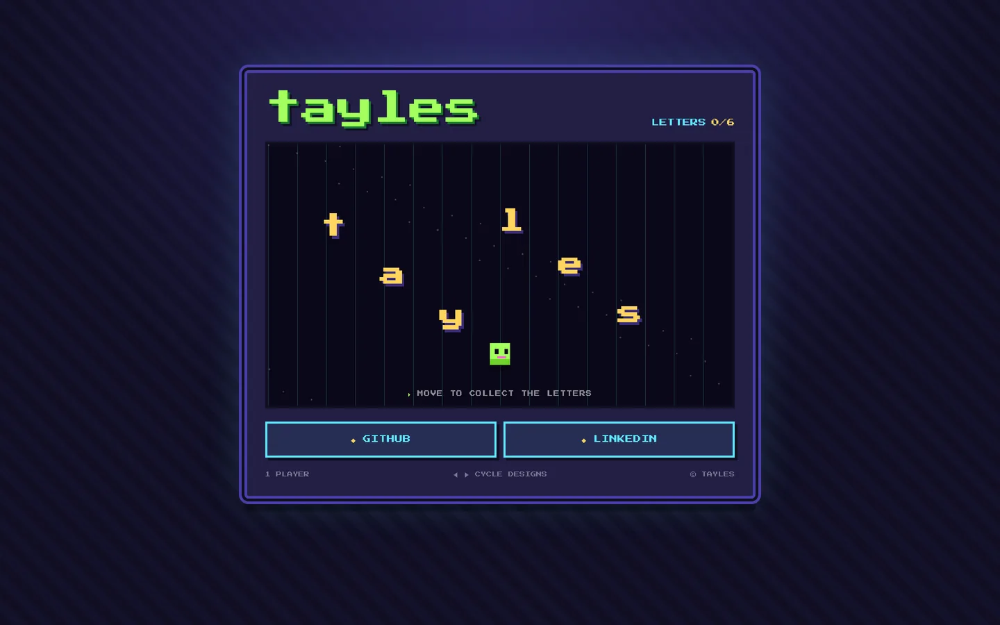
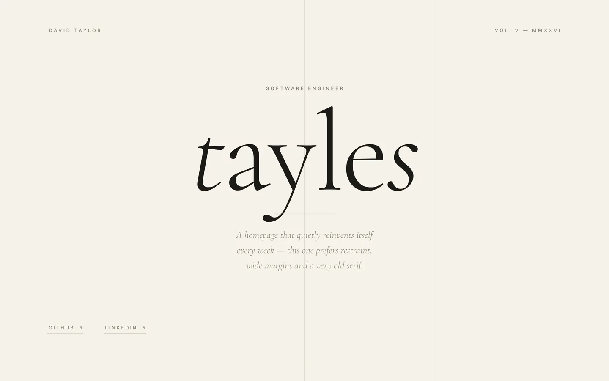
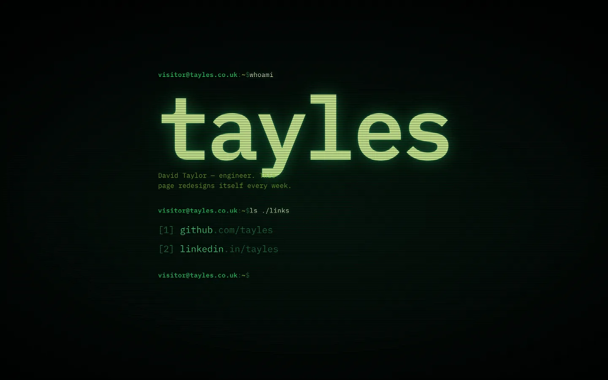

# Designs

<!-- Generated by `bun run designs:md`. Edit the design's
     `src/designs/<slug>/index.md` instead of this file. -->

[tayles.co.uk](https://tayles.co.uk) wears a different design every week — a new one is
generated, screenshotted and merged automatically. Every design it has ever
worn stays online at its own URL. Newest first.

**7 designs** ·
[Browse them live](https://tayles.co.uk/designs)

---

## Kiln

5 September 2026 · `kiln`

The word built as a slab of fired clay — thirty copies of the type stacked through the page, turning slowly on a plaster floor and casting its own shadow.

[Live](https://tayles.co.uk/designs/kiln) · [Source](src/designs/kiln/index.astro) · `3d` `sculpture` `terracotta` `light` `warm` `css` `animated`

---

## Pixel Quest

29 June 2026 · `pixel-quest`

A playable arcade cabinet — steer the sprite around the screen to collect the six letters of the name. The links work with or without playing.

[Live](https://tayles.co.uk/designs/pixel-quest) · [Source](src/designs/pixel-quest/index.astro) · `game` `pixel` `arcade` `interactive` `canvas` `dark` `playful`

---

## Atelier

15 June 2026 · `atelier`

Quiet editorial restraint — warm paper, a high-contrast Garamond with italic swash letters, hairline column rules and a slow settle on load.

[Live](https://tayles.co.uk/designs/atelier) · [Source](src/designs/atelier/index.astro) · `editorial` `serif` `minimal` `light` `elegant` `typography`

---

## Glitch City

1 June 2026 · `glitch-city`

Sun-bleached crime-poster typography over a blocky skyline, with RGB channel separation that tears into slices every few seconds.

[Live](https://tayles.co.uk/designs/glitch-city) · [Source](src/designs/glitch-city/index.astro) · `glitch` `gta` `poster` `halftone` `dark` `animated` `gradient`

---

## Brutalist

18 May 2026 · `brutalist`

Black ink on off-white paper. Each letter of the name gets its own cell in a four-pixel grid, with a marquee that refuses to soften anything.

[Live](https://tayles.co.uk/designs/brutalist) · [Source](src/designs/brutalist/index.astro) · `brutalist` `typography` `monochrome` `light` `grid` `swiss`

---

## Neon Drive

4 May 2026 · `neon-drive`

Full 1980s synthwave — chrome lettering with a sweeping shine, a scanline-cut sun and an endless neon grid rushing toward the horizon.

[Live](https://tayles.co.uk/designs/neon-drive) · [Source](src/designs/neon-drive/index.astro) · `retro` `80s` `synthwave` `neon` `gradient` `animated` `dark`

---

## Terminal

20 April 2026 · `terminal`

A phosphor-green CRT session — scanlines, screen flicker and a blinking block cursor, with the links listed like files on disk.

[Live](https://tayles.co.uk/designs/terminal) · [Source](src/designs/terminal/index.astro) · `terminal` `retro` `monospace` `dark` `crt` `animated`
