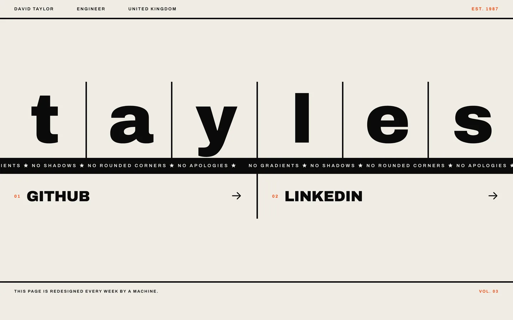

Black ink on off-white paper. Each letter of the name gets its own cell in a four-pixel grid, with a marquee that refuses to soften anything.

[View it live](https://tayles.co.uk/designs/brutalist)
