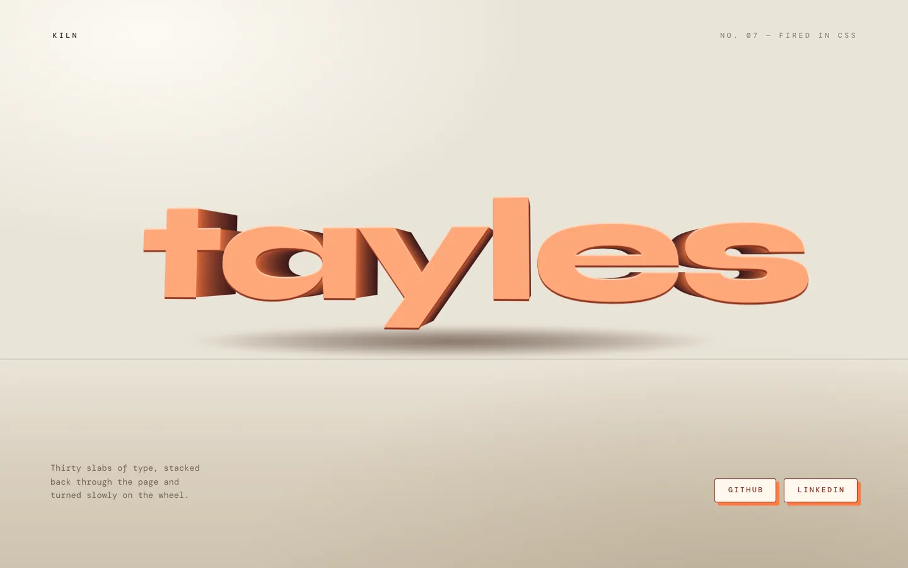

The word built as a slab of fired clay — thirty copies of the type stacked through the page, turning slowly on a plaster floor and casting its own shadow.

[View it live](https://tayles.co.uk/designs/kiln)
