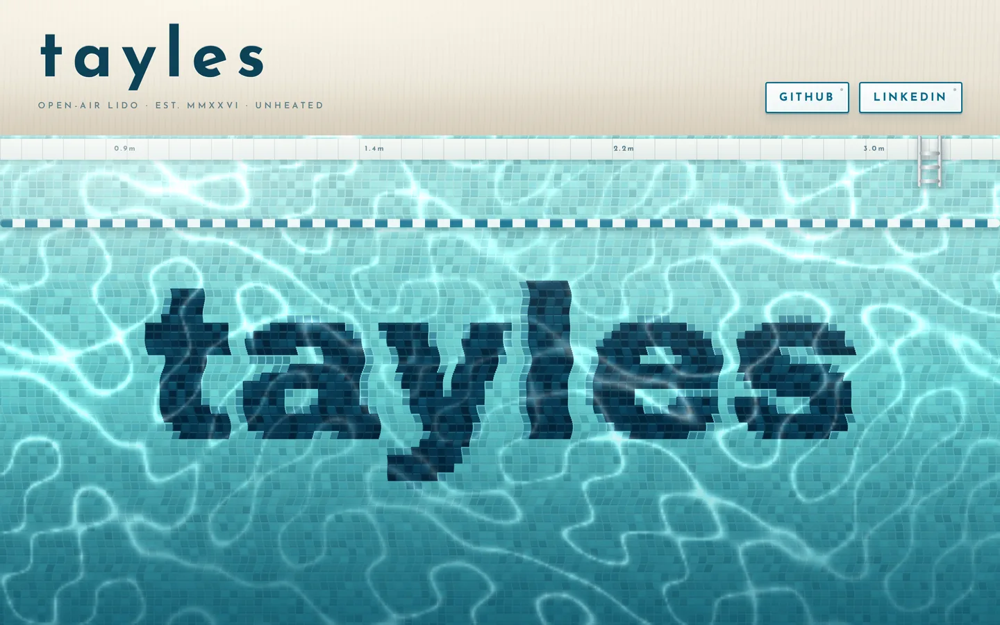

An open-air swimming pool from directly above — the word is laid into the floor in dark mosaic tiles, wobbling under the refracting surface while a net of caustic light drifts over it. Move the cursor and the water answers.

[View it live](https://tayles.co.uk/designs/lido)
