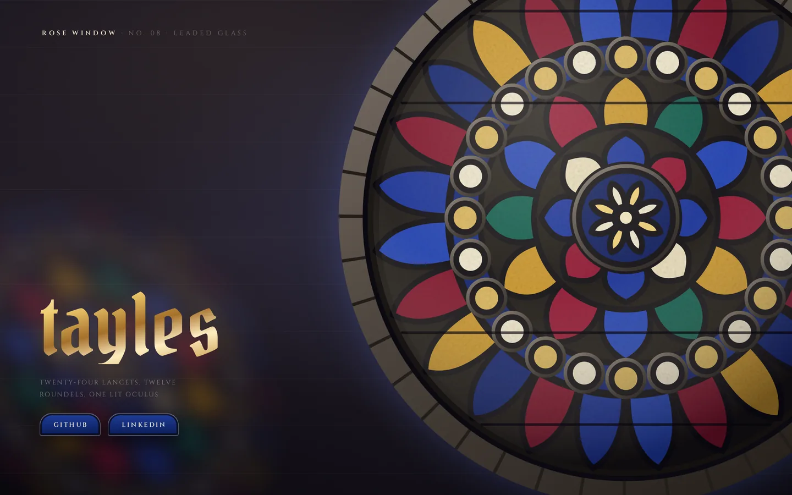

A Gothic rose generated in SVG — twenty-four leaded lancets, gilded roundels and a lit oculus — set into a stone wall, with the coloured light it throws drifting slowly across the name.

[View it live](https://tayles.co.uk/designs/rose-window)
