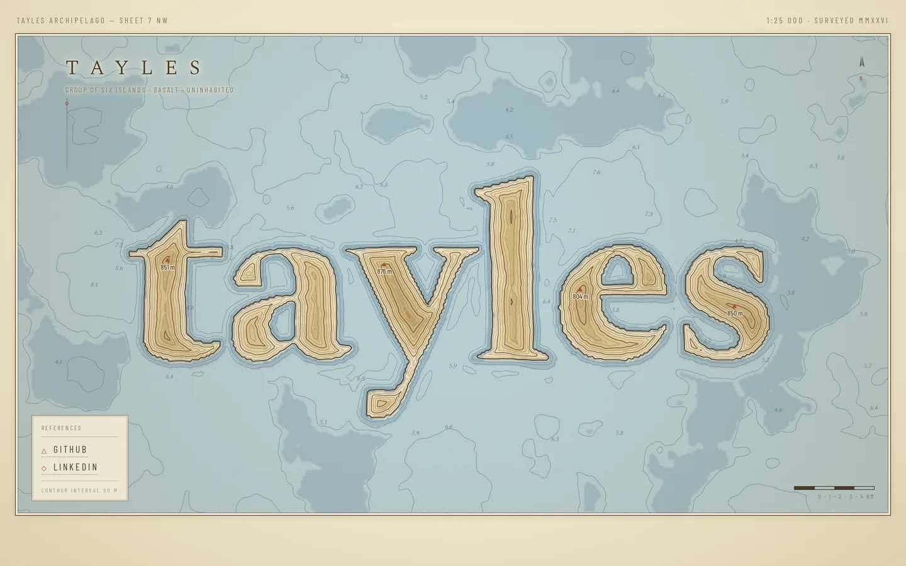

An Ordnance-style map sheet where the word is the land — the letterforms drive a height field that a canvas inks as contour lines, soundings and spot heights on aged paper.

[View it live](https://tayles.co.uk/designs/survey)
